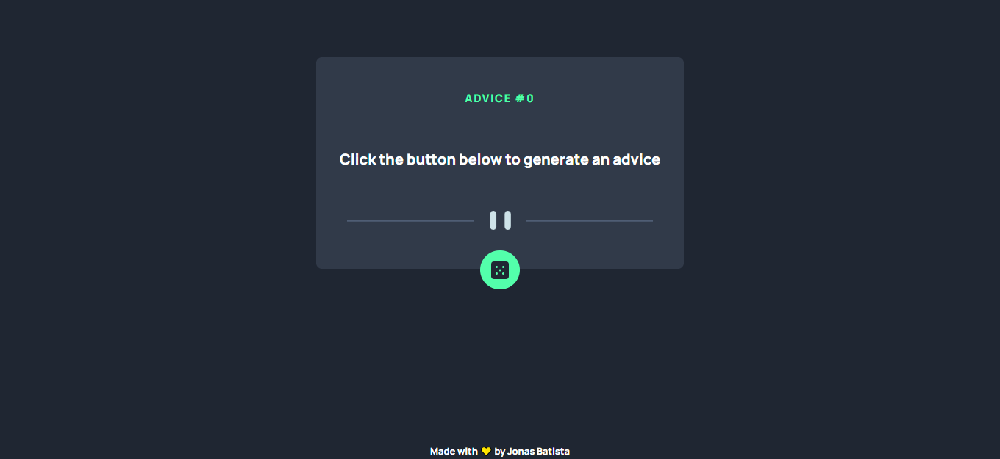

<h1 align='center'>Advice Generator App</h1>
</br>
<p align='center'>Construído usando técnica de API rest, a aplicação gera um conselho aleatório gerado pela api publica [Advice Slip](https://api.adviceslip.com/) fazendo uma divertida interação, o projeto também apresenta o uso de css grid e flex box </p>


<br/>

<h2 >Demonstração 📺</h2>

</br>

<h2>Stack utilizada 🛠</h2>
<p><b>Front-end:</b> React, TailwindCSS, Axios</p>

</br>

## Instalação ⚙

Instale AdviceApp com npm

```bash
  git clone https://github.com/jonas-nb/AdviceApp
  cd AdviceApp
  npm install
  npm start
```

<br/>

## Deploy ☁

Para fazer o deploy desse projeto rode

```bash
  npm vite build
```

<br/>

## Referência 📚

-   [Design preview for the Advice generator app coding challenge](./design/desktop-preview.jpg)
-   [Frontend Mentor](https://www.frontendmentor.io) challenges help you improve your coding skills by building realistic projects.

<br/>

## Autores 🖊

-   [@jonas-nb](https://www.github.com/jonas-nb)
